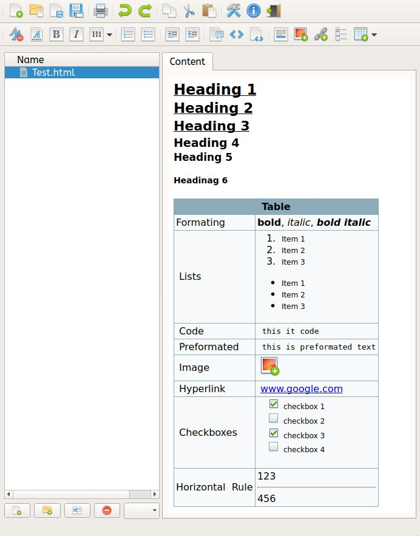

# Yanta

Yanta a simple note taking application built in python. It can save text notes in txt files and more complex notes.

## Installation

For installation you need to install (tested on linux and windows 8.1)

* Python 3 - https://www.python.org/
* Python modules - cssselect, requests, lxml
* PyQt <=5.5 - https://sourceforge.net/projects/pyqt/files/PyQt5/

To install the python modules, install pip during the python installation and after the installation run on the command line:

    pip install <MODULE_NAME>

You have trouble compiling the lxml for windows you can run the download the [unoficial windows binary](http://www.lfd.uci.edu/~gohlke/pythonlibs/#lxml) and run:

    pip install lzml-<VERSION>.whl

## Running

Run the command: 

	python yanta.py

or the shortcuts: `run.sh` for linux and `run.bat` for windows.

## Compiling (Windows)

You can run the application normally if install the mentioned dependencies but if you want build a windows binary for a more portability you need to install [cx_freeze](http://cx-freeze.sourceforge.net/) python package. If you installed the `pip` package during the python install just run the command:

	pip install cx_Freeze

and run the `build_exe.bat` file in application folder.
